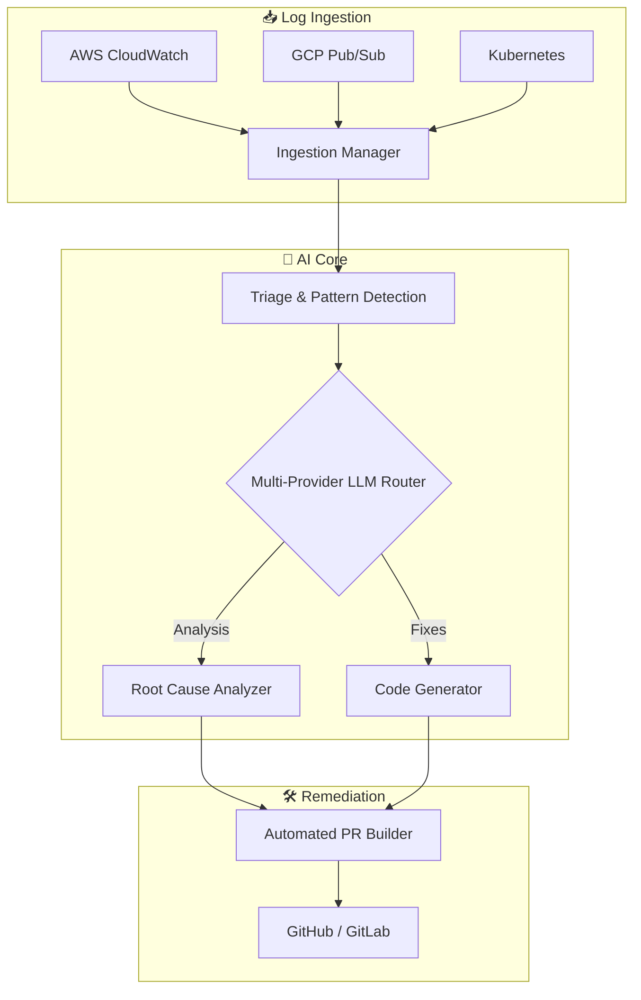

<div align="center">
  
# 👁️ Argus

**Autonomous, Multi-Provider Cloud SRE & AI Monitoring Assistant**

[](LICENSE)
[](https://python.org)
[](https://github.com/DsThakurRawat/Argus)
[](#)

*Your intelligent, self-healing cloud infrastructure partner.*

</div>

---

## 🚀 Overview

**Argus** is an advanced, autonomous multi-provider SRE (Site Reliability Engineering) agent designed to act as your always-on infrastructure watchdog. By leveraging the power of **100+ AI providers** (including OpenAI, Anthropic, Google Gemini, Ollama, and more), Argus continuously monitors your cloud logs, detects anomalies, and actively remediates issues without human intervention.

When critical events strike, Argus doesn't just send an alert—it creates a structured diagnosis, generates code fixes using a unified system, and proposes concrete remediation steps via automated **GitHub Pull Requests**.

## ✨ Key Features

- **🌐 Multi-Provider AI LLM Architecture**
  - Seamlessly switch between OpenAI, Anthropic, Gemini, Grok, and local models.
  - Built-in circuit breakers, cost-aware routing, and automatic fallback mechanisms.
- **📡 Enterprise Log Ingestion**
  - Pluggable adapters for **GCP Pub/Sub**, **AWS CloudWatch**, **Kubernetes**, and local files.
  - Robust backpressure handling, retry logic, and built-in rate limiting.
- **🧠 4-Layer Pattern Detection**
  - Identifies cascade failures, resource exhaustion, and service degradations.
  - Utilizes sliding window logic and ML-based similarity caching for minimal latency.
- **🛡️ Secure Code Generation**
  - Domain-specific code generators for database, API, and security fixes.
  - Pre-processing validation and PII/credential sanitization built-in.
- **⚡ Automated Remediation**
  - Self-healing workflows that package fixes into automated PRs ready for human review.

## 🏗️ System Architecture

Argus employs a modular, event-driven design to ensure high availability and redundancy.



> **Note:** For a complete deep-dive into the data flows and provider routing, see our [System Architecture Overview](docs/ARCHITECTURE.md).

## 📚 Documentation

Dive deeper into Argus's internal engines and subsystems:

| Component | Description |
|-----------|-------------|
| 📐 [**Architecture**](docs/ARCHITECTURE.md) | Deep dive into the core SRE loop and data flows. |
| 📥 [**Log Ingestion**](docs/LOG_INGESTION_SYSTEM_GUIDE.md) | Managing and configuring enterprise log adapters. |
| 🔍 [**Pattern Detection**](docs/PATTERN_DETECTION_SYSTEM.md) | Sliding window logic and anomaly classification. |
| 🧠 [**Prompt Generation**](docs/ENHANCED_PROMPT_GENERATION.md) | "AI teaching AI" meta-prompting strategies. |
| ⚙️ [**Code Generation**](docs/UNIFIED_ENHANCED_CODE_GENERATION.md) | Multi-level validation pipeline for robust code fixes. |

*Looking for operations and deployment? Check out our [Quickstart](docs/QUICKSTART.md), [Setup Guide](docs/SETUP_INSTALLATION.md), and [Deployment Guide](docs/DEPLOYMENT.md).*

## 🏎️ Quick Start

Get Argus up and running in your environment in under 15 minutes.

### 1. Prerequisites
- Python 3.12+
- `uv` package manager

### 2. Installation
```bash
# Clone the repository
git clone https://github.com/DsThakurRawat/Argus.git
cd Argus

# Install dependencies using uv
uv sync
```

### 3. Configuration & Auth
```bash
# Authenticate with your Cloud Provider (e.g., GCP)
gcloud auth application-default login

# Export your GitHub token for PR automation
export GITHUB_TOKEN="your_github_token_here"

# Enable core Argus engines
export USE_LOG_INGESTION_SYSTEM=true
export ENABLE_MONITORING=true
export ENABLE_LEGACY_FALLBACK=true
```

### 4. Run Argus
Configure your monitored services in `config/config.yaml` and launch the orchestrator:
```bash
python main.py
```

## 🤝 Contributing

Argus is built for the community. We welcome all contributions—from bug fixes to new LLM provider integrations! 
Please read our [Development & Contributing Guide](docs/DEVELOPMENT.md) for local testing patterns, code style, and PR submission workflows.

## 📄 License

Argus is open-source software licensed under the [MIT License](LICENSE).

---
<div align="center">
  <i>Built with ❤️ by the Argus Contributors.</i>
</div>
