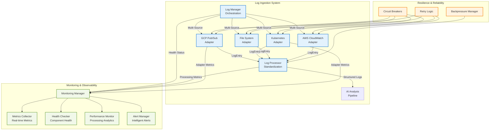

# Log Ingestion System Guide

The Argus features a **comprehensive log ingestion system** that provides enterprise-grade log processing capabilities with full backward compatibility. This system offers pluggable adapters, comprehensive monitoring, and production-ready resilience patterns.

## Log Ingestion Architecture



## Log Ingestion Capabilities

**Multi-Source Log Ingestion:**

- **GCP Pub/Sub**: Production-ready Google Cloud Pub/Sub integration with flow control and acknowledgment management
- **Kubernetes**: Container log collection with namespace filtering and pod-level granularity
- **File System**: Local and remote file monitoring with rotation support and pattern matching
- **AWS CloudWatch**: Amazon CloudWatch Logs integration with log group and stream management
- **Extensible Architecture**: Easy addition of log sources through the adapter pattern

**Enterprise-Grade Monitoring:**

- **Real-time Metrics**: Processing rates, error counts, latency tracking, and throughput analysis
- **Health Monitoring**: Component-level health checks with automated status reporting
- **Performance Analytics**: Resource utilization tracking and bottleneck identification
- **Intelligent Alerting**: Configurable alerts with escalation policies and notification channels

**Production-Ready Resilience:**

- **Circuit Breakers**: Prevent cascade failures and protect downstream systems
- **Backpressure Management**: Handle high-volume log streams without overwhelming the system
- **Automatic Retries**: Resilient error handling with exponential backoff and jitter
- **Graceful Degradation**: Fallback mechanisms and graceful shutdown procedures

**Unified Configuration:**

- **Single Configuration System**: Centralized configuration for all log sources and adapters
- **Runtime Updates**: Dynamic configuration changes without system restarts
- **Validation**: Comprehensive configuration validation with detailed error reporting
- **Environment Integration**: Seamless integration with environment variables and secrets management

## Configuration Strategy

The log ingestion system is designed for **zero-downtime deployment** with full backward compatibility:

**Feature Flag Control:**

```bash
# Enable log ingestion system
export USE_LOG_INGESTION_SYSTEM=true

# Enable comprehensive monitoring
export ENABLE_MONITORING=true

# Keep legacy fallback enabled
export ENABLE_LEGACY_FALLBACK=true
```

**Deployment Phases:**

1. **Phase 1**: Deploy with system disabled, enable monitoring
2. **Phase 2**: Enable system for non-critical services
3. **Phase 3**: Gradual expansion based on confidence and metrics
4. **Phase 4**: Full deployment with legacy system deprecation

**Safety Features:**

- **Automatic Fallback**: Seamless fallback to legacy system if system fails
- **Health Monitoring**: Real-time health checks and status reporting
- **Performance Tracking**: Comprehensive metrics for deployment validation
- **Rollback Capability**: Instant rollback via environment variable changes

## Benefits

**Operational Excellence:**

- **Observability**: Real-time monitoring and alerting capabilities
- **Improved Reliability**: Circuit breakers, retries, and graceful error handling
- **Better Performance**: Optimized processing with backpressure management
- **Simplified Operations**: Unified configuration and monitoring interface

**Future-Proof Architecture:**

- **Multi-Cloud Ready**: Support for GCP, AWS, and hybrid environments
- **Container Native**: Kubernetes integration with pod and namespace awareness
- **Extensible Design**: Easy addition of log sources and processing capabilities
- **Scalable Processing**: Horizontal scaling with load balancing and distribution

**Cost Optimization:**

- **Efficient Processing**: Optimized resource utilization and processing patterns
- **Smart Monitoring**: Cost-effective monitoring with configurable sampling
- **Intelligent Caching**: Response caching and similarity matching for API cost reduction
- **Resource Management**: Adaptive rate limiting and circuit breaker patterns
